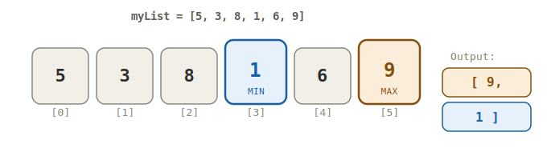
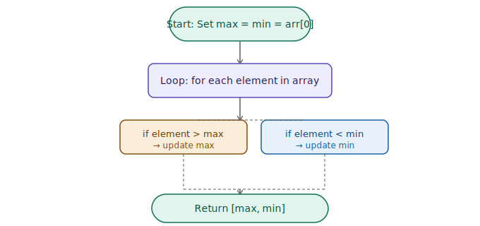

<div align="center">

# 🔍 Find Max & Min

### Java · Arrays · Interview Question


</div>

---

## 📌 Problem Statement

> Given an array of integers, write a method that finds the **maximum** and **minimum** numbers in the array.
> Return both as an integer array — **max at index 0**, **min at index 1**.

---

## 🔧 Method Signature

```java
public static int[] findMaxMin(int[] myList)
```

| Parameter | Type    | Description             |
|-----------|---------|-------------------------|
| `myList`  | `int[]` | Input array of integers |

**Returns:** `int[]` of size 2 → `[max, min]`

---

## 💡 Example

```
Input  : [5, 3, 8, 1, 6, 9]
Output : [9, 1]
```

### How it looks visually:



---

## 🧠 Approach

### Step-by-step logic:



---

## ✅ Solution (Java)

```java
/**
 * ╔══════════════════════════════════════════════════════════╗
 * ║  Find Max & Min in an Array — Java                       ║
 * ╚══════════════════════════════════════════════════════════╝
 *
 * Problem   : Find Maximum and Minimum in Array
 * Difficulty: Easy
 * Topic     : Arrays
 *
 * ── APPROACH ───────────────────────────────────────────────
 * Initialize max and min to the first element.
 * Loop through the array once, updating max and min.
 *
 * ── COMPLEXITY ─────────────────────────────────────────────
 * Time : O(n)  — single pass through the array
 * Space: O(1)  — only two extra variables used
 */
public class FindMaxMin {

    public static int[] findMaxMin(int[] myList) {

        // Edge case: empty array
        if (myList == null || myList.length == 0) {
            return new int[]{};
        }

        int max = myList[0];  // start with first element
        int min = myList[0];  // start with first element

        for (int i = 1; i < myList.length; i++) {
            if (myList[i] > max) {
                max = myList[i];  // found a new max
            }
            if (myList[i] < min) {
                min = myList[i];  // found a new min
            }
        }

        return new int[]{max, min};
    }

    // ── TEST ──────────────────────────────────────────────
    public static void main(String[] args) {
        System.out.println(Arrays.toString(findMaxMin(new int[]{5, 3, 8, 1, 6, 9})));
        // Expected: [9, 1]

        System.out.println(Arrays.toString(findMaxMin(new int[]{-5, -1, -10, 0})));
        // Expected: [0, -10]

        System.out.println(Arrays.toString(findMaxMin(new int[]{42})));
        // Expected: [42, 42]
    }
}
```

---

## 📊 Complexity Analysis

| | Brute Force | Optimal (This Solution) |
|---|---|---|
| **Time** | O(n²) | ✅ **O(n)** |
| **Space** | O(1) | ✅ **O(1)** |
| **Passes** | Multiple | ✅ **Single pass** |

---

## 🧪 Test Cases

| Input | Expected Output | Notes |
|-------|-----------------|-------|
| `[5, 3, 8, 1, 6, 9]` | `[9, 1]` | Normal case |
| `[-5, -1, -10, 0]` | `[0, -10]` | Negative numbers |
| `[7, 7, 7]` | `[7, 7]` | All duplicates |
| `[42]` | `[42, 42]` | Single element |
| `[0, 0, 1]` | `[1, 0]` | Contains zero |

---

## ⚠️ Edge Cases to Remember

- **Negative numbers** — `min` must be initialized to `arr[0]`, not `0`
- **All duplicates** — max and min will be equal, that's valid
- **Single element** — returns `[x, x]`
- **Null / empty array** — return `{}` or handle gracefully

---

## 🔑 Key Takeaway

> Initialize **both `max` and `min` to `arr[0]`** — never to `0` or `Integer.MAX_VALUE` unless you know your constraints.
> One pass is all you need. 🚀

---

<div align="center">

*Part of the **Binary Brain** DSA series by [@Niladri035](https://github.com/Niladri035)*

</div>