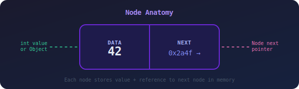
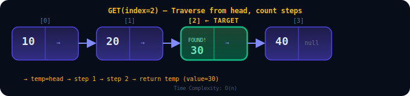
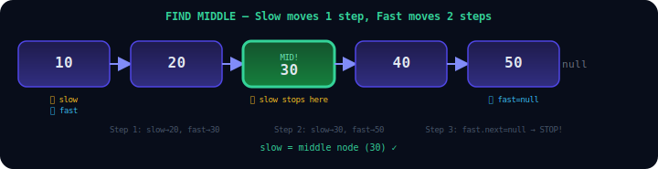
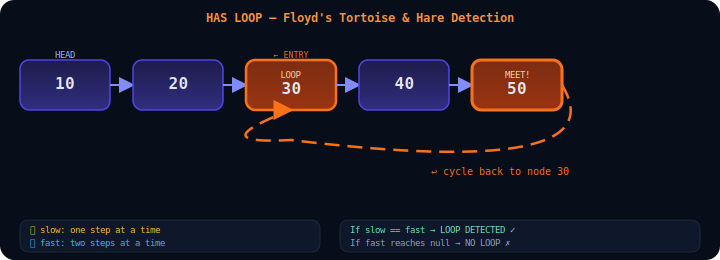

<div align="center">

<!-- Animated Header Banner -->


<br/>


</div>

---

## 📋 Table of Contents

| # | Operation | Complexity |
|---|-----------| -----------|
| 01 | [🔨 Create LinkedList & Node](#-1-create-linkedlist--node) | O(1) |
| 02 | [⬅️ Prepend — Add to Front](#-2-prepend--add-to-front) | O(1) |
| 03 | [🗑️ Remove Last Node](#-3-remove-last-node) | O(n) |
| 04 | [✂️ Remove First Node](#-4-remove-first-node) | O(1) |
| 05 | [🔍 Get — Value by Index](#-5-get--value-by-index) | O(n) |
| 06 | [✏️ Set — Update by Index](#-6-set--update-by-index) | O(n) |
| 07 | [📌 Insert at Index](#-7-insert-at-index) | O(n) |
| 08 | [🧹 Remove at Index](#-8-remove-at-index) | O(n) |
| 09 | [🔄 Reverse the List](#-9-reverse-the-list) | O(n) |
| 10 | [🎯 Find Middle Node](#-10-find-middle-node) | O(n) |
| 11 | [🔁 Detect Loop (Floyd's)](#-11-detect-loop--floyds-algorithm) | O(n) |

---

## 🧠 What is a LinkedList?

> A **LinkedList** is a linear data structure where each element (called a **Node**) contains **data** and a **pointer** to the next node, forming a chain.

<div align="center">



</div>

---

## 🔨 1. Create LinkedList & Node

A LinkedList is built from **Node** objects. Each node holds a value and a reference to the next node.

<div align="center">



</div>

```java
// 🔷 Node class — the building block
class Node {
    int value;
    Node next;

    Node(int value) {
        this.value = value;
        this.next = null;
    }
}

// 🔷 LinkedList class
public class LinkedList {
    private Node head;
    private Node tail;
    private int length;

    // Constructor — creates list with first node
    public LinkedList(int value) {
        Node newNode = new Node(value);
        head = newNode;
        tail = newNode;
        length = 1;
    }
}
```

> 💡 **Key Idea:** `head` points to the **first** node. `tail` points to the **last** node. `length` tracks count — no need to traverse!

---

## ⬅️ 2. Prepend — Add to Front

Insert a new node **before** the current head. The new node becomes the new head.

<div align="center">



</div>

```java
public void prepend(int value) {
    Node newNode = new Node(value);   // ① create new node
    if (length == 0) {
        head = newNode;
        tail = newNode;
    } else {
        newNode.next = head;          // ② new node points to old head
        head = newNode;              // ③ head moves to new node
    }
    length++;                        // ④ increment length
}
```

| Step | Action | Time |
|------|--------|------|
| Create node | `new Node(value)` | O(1) |
| Link | `newNode.next = head` | O(1) |
| Update head | `head = newNode` | O(1) |
| **Total** | **Constant time** | **O(1)** ✅ |

---

## 🗑️ 3. Remove Last Node

Traverse to the second-to-last node and set its `next` to `null`.

<div align="center">


</div>

```java
public Node removeLast() {
    if (length == 0) return null;

    Node temp = head;
    Node pre = head;

    while (temp.next != null) {   // traverse to last node
        pre = temp;
        temp = temp.next;
    }

    tail = pre;          // update tail to previous node
    tail.next = null;    // disconnect the last node
    length--;

    if (length == 0) {   // edge case: list becomes empty
        head = null;
        tail = null;
    }
    return temp;         // return removed node
}
```

---

## ✂️ 4. Remove First Node

Simply move `head` to the next node. Super fast — **O(1)**!

<div align="center">


</div>

```java
public Node removeFirst() {
    if (length == 0) return null;

    Node temp = head;     // save reference to current head
    head = head.next;     // move head forward
    temp.next = null;     // detach removed node
    length--;

    if (length == 0) tail = null;  // list is now empty

    return temp;
}
```

---

## 🔍 5. Get — Value by Index

Traverse from `head`, counting until you reach the target index.

<div align="center">



</div>

```java
public Node get(int index) {
    if (index < 0 || index >= length) return null;

    Node temp = head;
    for (int i = 0; i < index; i++) {
        temp = temp.next;   // walk forward
    }
    return temp;
}
```

---

## ✏️ 6. Set — Update by Index

Find the node at index using `get()`, then update its value.

```java
public boolean set(int index, int value) {
    Node temp = get(index);   // reuse get() to find node

    if (temp != null) {
        temp.value = value;   // update in place
        return true;
    }
    return false;
}
```

> 🔁 **Reuse `get()`** — No need to rewrite traversal logic!

---

## 📌 7. Insert at Index

Insert a node at any position. Handle head/tail as edge cases.

<div align="center">



</div>

```java
public boolean insert(int index, int value) {
    if (index < 0 || index > length) return false;
    if (index == 0) { prepend(value); return true; }    // front
    if (index == length) { append(value); return true; } // end

    Node newNode = new Node(value);
    Node prev = get(index - 1);       // node BEFORE insertion point
    Node next = prev.next;            // node AFTER insertion point

    newNode.next = next;              // ① link new → next
    prev.next = newNode;             // ② link prev → new
    length++;
    return true;
}
```

---

## 🧹 8. Remove at Index

Redirect the previous node's pointer to skip the target node.

```java
public Node remove(int index) {
    if (index < 0 || index >= length) return null;
    if (index == 0) return removeFirst();        // edge: head
    if (index == length - 1) return removeLast(); // edge: tail

    Node prev = get(index - 1);
    Node temp = prev.next;   // node to remove

    prev.next = temp.next;   // skip over temp
    temp.next = null;        // isolate removed node
    length--;
    return temp;
}
```

---

## 🔄 9. Reverse the List

Reverse all pointers in a single O(n) pass — pure pointer magic!

<div align="center">



</div>

```java
public void reverse() {
    // Swap head and tail
    Node temp = head;
    head = tail;
    tail = temp;

    Node after;
    Node before = null;
    Node current = tail;   // start from old head (now tail)

    for (int i = 0; i < length; i++) {
        after = current.next;    // save next
        current.next = before;   // flip pointer ←
        before = current;        // advance before
        current = after;         // advance current
    }
}
```

> 🧠 **Three-pointer technique:** `before`, `current`, `after` — each step flips one arrow!

---

## 🎯 10. Find Middle Node

**Floyd's Tortoise & Hare** — Two pointers at different speeds meet at the middle!

<div align="center">



</div>

```java
public Node findMiddleNode() {
    Node slow = head;   // 🐢 moves 1 step
    Node fast = head;   // 🐇 moves 2 steps

    while (fast != null && fast.next != null) {
        slow = slow.next;        // 1 hop
        fast = fast.next.next;   // 2 hops
    }

    return slow;   // when fast reaches end, slow is at middle!
}
```

> 🎯 **Why it works:** Fast pointer covers 2x distance. When fast hits the end, slow is exactly at the midpoint. No need to know the length!

---

## 🔁 11. Detect Loop — Floyd's Algorithm

Detect if the list contains a cycle. The classic **Tortoise & Hare** algorithm!

<div align="center">



</div>

```java
public boolean hasLoop() {
    Node slow = head;   // 🐢 moves 1 step per iteration
    Node fast = head;   // 🐇 moves 2 steps per iteration

    while (fast != null && fast.next != null) {
        slow = slow.next;        // advance slow by 1
        fast = fast.next.next;   // advance fast by 2

        if (slow == fast) return true;  // they MET → loop exists!
    }

    return false;   // fast reached null → no loop
}
```

> 🔑 **Why they always meet:** In a cycle, fast gains on slow by 1 node per step. In a loop of size `k`, they meet after at most `k` steps — guaranteed!

---

## 📊 Big-O Complexity Summary

<div align="center">



</div>

---

## 🆚 LinkedList vs Array

| Feature | LinkedList | Array |
|---------|-----------|-------|
| **Prepend** | ✅ O(1) | ❌ O(n) |
| **Append** | ✅ O(1) | ✅ O(1) amortized |
| **Random Access** | ❌ O(n) | ✅ O(1) |
| **Memory** | Extra pointer per node | Contiguous block |
| **Insert Middle** | O(n) traversal | O(n) shifting |
| **Cache Friendly** | ❌ | ✅ |

---

## 📁 Project Structure

```
LinkedList-Java/
│
├── assets/                    # SVG diagrams for README
├── src/
│   ├── Node.java              # Node building block
│   ├── LinkedList.java        # Main LinkedList class
│   └── Main.java              # Demo & test runner
│
└── README.md                  # This file ✨
```

---

<div align="center">


---

⭐ **Star this repo** if it helped you understand LinkedLists!

`Happy Coding! 🚀`

</div>